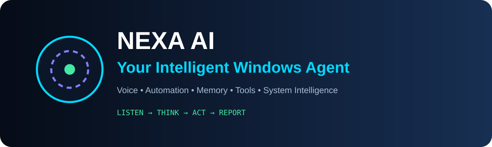
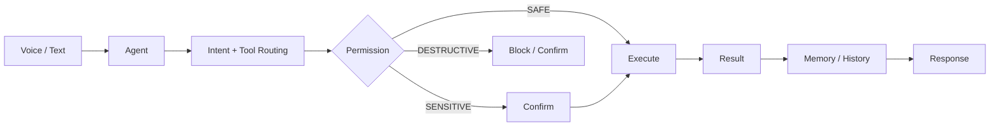

<div align="center">




[](https://www.python.org/)
[](https://www.electronjs.org/)
[](https://react.dev/)
[](https://fastapi.tiangolo.com/)

### 🤖 NEXA AI — A Controlled Windows AI-Agent Foundation

**A modular desktop assistant for voice commands, memory, file intelligence, browser automation and permission-aware tools.**

</div>

---

## 🧠 What is NEXA?

NEXA is designed around a simple principle: an AI agent should not only generate a response — it should **decide what tool to use, respect permissions, execute controlled actions and report the result.**

External AI/STT/TTS providers require your own credentials and configuration.

## ⚡ Agent Loop



## ✨ Capabilities

- 🎙️ Hindi / Hinglish / English command flow
- 🖥️ Windows desktop interface
- 🧠 Local memory and command history
- 📁 File intelligence and search
- 🌐 Browser automation
- ⚙️ Controlled Windows automation
- 📊 System monitoring
- 🔌 Extensible tool registry
- 🔐 Permission-aware execution
- 🎭 Deterministic local demo mode

## 🛡️ Permission Model

| Level | Behaviour |
|---|---|
| 🟢 SAFE | Can run automatically |
| 🟡 SENSITIVE | Confirmation can be required |
| 🔴 DESTRUCTIVE | Confirmation required / blocked by policy |

The terminal tool uses an allowlist by default. **Do not remove the safety layer just to make the demo appear more capable.**

## 🧰 Stack

**Desktop:** Electron • React • TypeScript • Vite  
**UI:** Tailwind CSS • Framer Motion  
**Agent:** Python • FastAPI • WebSocket  
**Storage:** SQLite  
**Automation:** Playwright • psutil • pyautogui where configured  
**Validation:** Pydantic  
**Tests:** pytest • Vitest

## 🚀 Quick Start

### Windows launcher

- `START_NEXA.bat` — starts the backend and launches Electron.
- `START_WEB.bat` — starts the backend and opens the web interface.

### Manual setup

```powershell
cd backend
python -m venv .venv
.\.venv\Scripts\Activate.ps1
pip install -r requirements.txt
copy .env.example .env
uvicorn app.main:app --host 127.0.0.1 --port 8765
```

Desktop:

```powershell
cd desktop
npm install
npm run electron:dev
```

## 🔌 Provider Layer

Provider interfaces are separated into:

```text
backend/app/providers/ai.py
backend/app/providers/stt.py
backend/app/providers/tts.py
```

The default demo provider is local and deterministic, so the foundation can be explored without an external API key.

## 📁 Project Map

```text
Nexa-Ai-like-jarvis/
├── desktop/
│   ├── src/
│   ├── electron/
│   └── package.json
├── backend/
│   ├── app/
│   │   ├── agent/
│   │   ├── api/
│   │   ├── automation/
│   │   ├── memory/
│   │   ├── providers/
│   │   ├── security/
│   │   ├── storage/
│   │   └── tools/
│   ├── tests/
│   └── requirements.txt
├── docs/
├── scripts/
└── .env.example
```

## 🧪 Demo Commands

```text
Chrome kholo
System status bata
Downloads mein PDFs dhund
Git status check kar
```

## 🔐 Security Checklist

- Keep `.env` out of Git.
- Never commit API keys, cookies or browser profiles.
- Keep sensitive/destructive tools behind explicit permissions.
- Bind local services to `127.0.0.1` unless remote access is intentionally configured.

## 🗺️ Roadmap

- [x] Modular agent architecture
- [x] Tool registry
- [x] Permission-aware execution
- [x] Local memory / history
- [x] Desktop UI
- [ ] More provider integrations
- [ ] Expanded evaluation suite
- [ ] Stronger sandboxing for external actions

---

<div align="center">

### 🤖 THINK SMART · ACT SAFELY

**Built by Sahil Chand**

</div>
