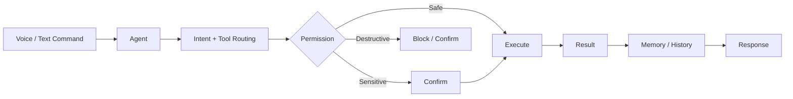

<div align="center">


[](https://www.python.org/)
[](https://www.electronjs.org/)
[](https://react.dev/)
[](https://fastapi.tiangolo.com/)

### 🤖 Listen → Think → Act → Report

**A modular Windows desktop AI-agent foundation for voice commands, controlled automation, memory, file intelligence and system tools.**

</div>

---

## 🧠 What is NEXA AI?

NEXA AI is a modular Windows desktop AI voice-agent foundation designed for natural Hindi/Hinglish/English commands, controlled Windows automation, file intelligence, browser automation, system monitoring, local memory, automations, command history, permissions and a premium desktop UI.

> The supplied project is a structured foundation. External AI/STT/TTS providers require the user's own credentials and configuration.

## ✨ Capabilities

- 🎙️ Hindi / Hinglish / English command flow
- 🖥️ Windows desktop interface
- 🧠 Local memory and command history
- 📁 File intelligence and search
- 🌐 Browser automation
- ⚙️ Controlled Windows automation
- 📊 System monitoring
- 🔌 Extensible tool registry
- 🔐 Permission-aware tool execution
- 🎭 Demo mode with deterministic local provider

## ⚡ Agent Flow



## 🛡️ Safety Model

| Permission | Behaviour |
|---|---|
| SAFE | Can run automatically |
| SENSITIVE | Configurable confirmation |
| DESTRUCTIVE | Confirmation required |

The terminal tool uses an allowlist by default. Do not disable the security layer just to make the demo appear more capable.

## 🛠️ Stack

**Desktop:** Electron • React • TypeScript • Vite  
**UI:** Tailwind CSS • Framer Motion  
**Agent:** Python • FastAPI • WebSocket  
**Storage:** SQLite  
**Automation:** Playwright • Python subprocess / psutil / pyautogui where configured  
**Validation:** Pydantic  
**Tests:** pytest • Vitest

## 🚀 Requirements

- Windows 11
- Node.js 20+
- Python 3.11+
- npm
- Optional Git / Docker / VS Code
- Optional Playwright browser binaries

## ⚡ Quick Start

### One-click Windows launch

- `START_NEXA.bat` — starts the Python backend and launches the Electron application.
- `START_WEB.bat` — starts the backend and opens the web interface.

### Manual setup

Backend:

```powershell
cd backend
python -m venv .venv
.\.venv\Scripts\Activate.ps1
pip install -r requirements.txt
copy .env.example .env
uvicorn app.main:app --host 127.0.0.1 --port 8765
```

Desktop:

```powershell
cd desktop
npm install
npm run electron:dev
```

Production build:

```powershell
npm run build
npm run dist
```

## 🔌 AI / Voice Providers

Provider interfaces are separated into:

- `backend/app/providers/ai.py`
- `backend/app/providers/stt.py`
- `backend/app/providers/tts.py`

The default demo provider is deterministic and local so the application can run without an API key.

## 📁 Project Structure

```text
Nexa-Ai-like-jarvis/
├── desktop/
│   ├── src/
│   ├── electron/
│   └── package.json
├── backend/
│   ├── app/
│   │   ├── agent/
│   │   ├── api/
│   │   ├── automation/
│   │   ├── memory/
│   │   ├── providers/
│   │   ├── security/
│   │   ├── storage/
│   │   └── tools/
│   ├── tests/
│   └── requirements.txt
├── docs/
├── scripts/
└── .env.example
```

## 🧪 Demo Commands

Try commands such as:

```text
Chrome kholo
System status bata
Downloads mein PDFs dhund
Git status check kar
```

## 🔐 Security Note

Never commit `.env`, API keys, access tokens, cookies, browser profiles or private credentials.

---

<div align="center">

### 🤖 Build an assistant that can act — safely.

**Built by Sahil Chand**

</div>
